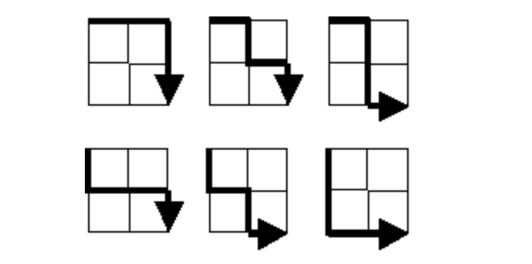

[Project Euler #015: Lattice Paths](https://www.hackerrank.com/contests/projecteuler/challenges/euler015/problem)

Starting in the top left corner of a $2 X 2$ grid, and only being able to move to the right and down, there are exactly $6$ routes to the bottom right corner.

How many such routes are there through a $20 X 20$ grid?